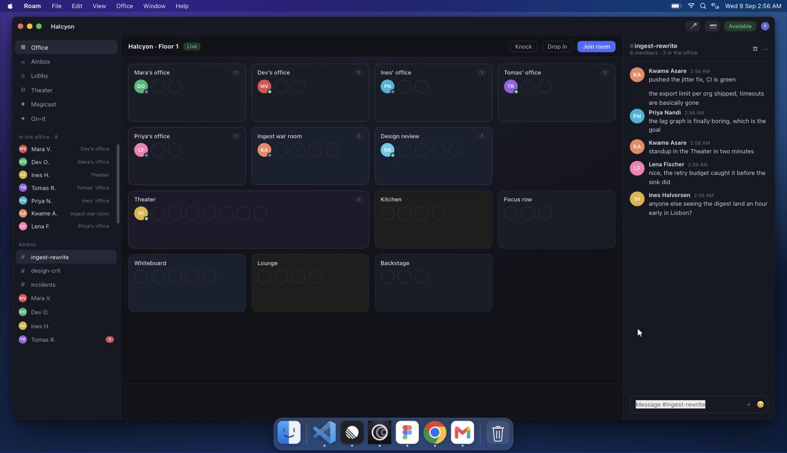

# Kunwari

*Kunwari* is Tagalog for **pretend** — as in *kunwaring may ginagawa*, pretending to
be busy. That is the whole program.

It is a fake macOS desktop that works so you don't have to. Six simulated apps take
turns in front — VS Code, Linear, Roam, Figma, PostHog and Gmail — typing code,
triaging issues, walking between virtual meeting rooms and refreshing dashboards,
while you are somewhere else entirely. Put it fullscreen on a second monitor and it
will keep this up indefinitely.

Everything in it is fictional and entirely local. No network calls, no accounts, no
telemetry, no data. It is a screensaver with impostor syndrome.

## Download

Grab a build from the [latest release](https://github.com/edwardguevarra/kunwari/releases/latest).
Each one is a single self-contained executable — the whole app lives inside it. No
installer, no runtime, nothing written to disk.

| Platform | File |
| --- | --- |
| macOS (Apple silicon) | `kunwari_*_darwin_arm64.tar.gz` |
| macOS (Intel) | `kunwari_*_darwin_amd64.tar.gz` |
| Linux (x86-64 / arm64) | `kunwari_*_linux_amd64.tar.gz` / `_arm64.tar.gz` |
| Windows (x86-64 / arm64) | `kunwari_*_windows_amd64.zip` / `_arm64.zip` |
| Anything with a browser | `kunwari.html` — one file, double-click it |

Unpack and run it. It picks a free port, opens your browser and prints the URL:

    ./kunwari                # or double-click kunwari.exe on Windows
    ./kunwari --port 8420    # pin the port
    ./kunwari --no-open      # don't open a browser

The binaries are not code-signed, so the first launch needs one extra step:

* **macOS** — right-click the file and choose *Open*, or run
  `xattr -dr com.apple.quarantine kunwari` once.
* **Windows** — SmartScreen shows "Windows protected your PC"; choose
  *More info → Run anyway*.

If you would rather not run an unsigned binary, `kunwari.html` is the same app in a
single file you can read before opening, and running from source below needs nothing
but Python.

## Run from source

    ./serve.sh            # http://localhost:8420
    ./serve.sh 9000       # or pick your own port

Then click **Start working**. It goes fullscreen on its own.

No build step, no dependencies, no package manager. It is HTML, CSS and plain
JavaScript served by Python's `http.server` — you can also just open `index.html`.

## Building the releases yourself

    tools/build-release.sh v1.0.0     # needs a Go toolchain, nothing else
    python3 tools/build-single.py     # just the one-file kunwari.html

`main.go` is a ~90-line launcher that embeds the site with `go:embed`, serves it on a
local port and opens a browser. It is the only Go in the project, and the app itself
does not know it exists.

## What it fakes

* **The desktop** — menu bar carrying the front app's own menus, dock with running
  indicators, notification banners, and a ghost cursor that drifts over whatever the
  active app considers interesting.
* **The browser tab title** follows the front window, so a glance at the tab bar says
  `queue.ts — halcyon — Visual Studio Code` or `Inbox (8) - you@halcyon.dev - Gmail`.
* **VS Code** (Dark Modern) — types plausible TypeScript line by line with syntax
  highlighting, switches files, and runs `pnpm test` / `git status` in the terminal.
* **Linear** — issues advance through the workflow, the detail panel follows along,
  and shipped work recycles into fresh backlog so the board never freezes.
* **Roam** — the virtual office: people move between private offices, meeting rooms,
  the Theater and the Kitchen; someone is always screensharing; the AInbox fills up
  with messages, typing indicators and unread badges.
* **Figma** — two collaborator cursors, layer selection, nudged geometry, live X/Y/W/H.
* **PostHog** and **Gmail** run inside a Chrome window, tab strip and omnibox included.
  Gmail reads your mail, types a reply that actually answers it, and sends.

## Making it yours

Open **Customise workspace** on the setup screen. Everything is saved to
`localStorage`, so it comes back next time:

| Field | Shows up as |
| --- | --- |
| Company | Linear workspace, Roam floor, PostHog org, window titles |
| Your name | your avatar initials everywhere, and your email address |
| Email domain | your address and every sender's address in Gmail |
| Repo / Branch | VS Code title, file tree root, terminal prompt, status bar |
| Project | the Linear issue's project |
| Figma file | the Figma file name and page |
| Dashboard | the PostHog dashboard, its URL and its browser tab |
| Teammates | every name in the product |

The teammate list drives more than it looks like it does: initials, avatar colours,
roles, Roam's private offices, issue assignees, chat authors, activity feeds and
notifications all derive from it, and email senders are assigned deterministically so
the same message always comes from the same person. **Reset to defaults** brings back
the fictional Halcyon team.

## Keys

| key | what |
| --- | --- |
| `F` | toggle fullscreen |
| `1`–`6` | bring an app to the front |
| `space` / `esc` | pause + menu |
| `N` | force a notification |

## Layout

    index.html          boot panel, menu bar, desktop, dock
    css/shell.css       desktop chrome
    css/apps.css        per-app skins
    js/util.js          pausable scheduler, typewriter, browser chrome, helpers
    js/data.js          every piece of fake content in one place
    js/config.js        the workspace settings, and how they reshape the content
    js/icons.js         app icons (generated — see tools/)
    js/shell.js         mounts apps, rotates them, drives cursor and titles
    js/apps/*.js        one simulation per app
    main.go             the launcher that embeds and serves it all
    tools/              icon fetcher + generator, release builds, source logos

Each app registers `{ id, icon, name, macName, menus, title, mount, start, stop,
cursorTargets }` with `LB.register(...)`. To add one: drop a file in `js/apps/`, add a
`<script>` tag, add its icon to `tools/build-icons.py` and re-run it.

Two details worth knowing if you extend it. Timers go through `LB.Clock`, which can be
paused and resumed as a group — that is how `space` freezes everything mid-keystroke.
And text pools come out of `LB.bag()`, a shuffled bag that never repeats an item until
the whole pool has been used, because a repeat is instantly noticeable to anyone
actually watching the screen.

## Repetition

Pools live in `js/data.js`: 35 issue titles, 14 emails each with its own matching
reply, 30 chat lines, 7 code snippets, 10 shell commands, 12 insights, 15
notifications. PostHog's numbers are a random walk and never repeat. Widen any pool by
adding lines — nothing else needs to change.

## Icons

The brand marks are the real ones rather than redraws: Chrome, VS Code, Linear, Figma
and Gmail come from [gilbarbara/logos](https://github.com/gilbarbara/logos), PostHog's
hedgehog from [simple-icons](https://simple-icons.org), and Roam's is its own
`apple-touch-icon` from ro.am. Finder and Trash are drawn by hand. To refresh:

    tools/fetch-icons.sh          # re-download into tools/logos/
    python3 tools/build-icons.py  # regenerate js/icons.js

Each logo is normalised into one 100×100 tile — `fit` controls how much of the tile the
mark fills, `tile` is the rounded square behind it (null for marks like Chrome and VS
Code that are already their own icon shape).

## Trademarks

This is a parody of a workday, not a product from anyone. Every company, person, issue
and email in it is invented. The app names and logos belong to their respective owners
and appear here only to make the simulation legible; no affiliation or endorsement is
implied. The MIT licence below covers this project's own code, not those marks.

## Licence

MIT — see [LICENSE](LICENSE).
